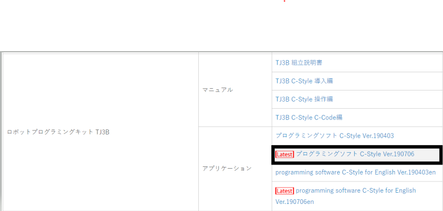
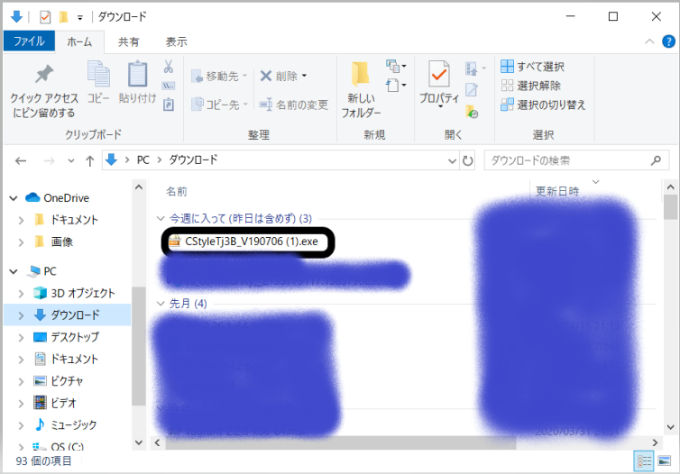
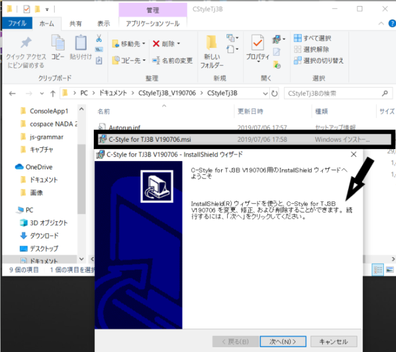

# インストール手順

- ブラウザを開き、[このリンク](http://www.daisendenshi.com/download/)を開く
-下のほうまで見ていって、「ロボットキット」という見出しの中に、『プログラミングソフトC-Style Ver.190706』というのがあるので、そこをクリック

- 下にダウンロードの表示が出るので、残りが0秒になったらそこをダブルクリック
- WindowsによってPCが保護されましたと出たら詳細情報をクリックしてから、実行ボタンをクリック
- もし圧縮解凍指定と出たら圧縮ボタンをクリック
- エクスプローラーを開いて、「ダウンロード」をクリックして「CStyleTJ3B_V190706.exe」があればOK

- ドキュメントを開いて、CStyleTj3B_V190706をダブルクリック
- その中のCStyleTJ3Bをダブルクリックし、C-Style for TJ3B V190706.msiをダブルクリック

- 「次へ」を3度クリック
- 「インストール」をクリック
- 「完了」をクリック

# 修正が必要なところ
 * markdownには、URLを記載する文法があります。 [例えば、こんなかんじ](https://www.google.com)。これを使ってください
 * 「」と検索し、～を開くか、[このリンク]()を開いてください。と書いたほうがいいと思う。
 ** ただし、文章が長くなりすぎる場合は、2つにわけたほうがよい
 * 要所要所で画像を入れたほうがよい。テキストを読む人は、今の状態で正しいのか不安になる。
 * クイックアクセスに、ダウンロードがない可能性もあるから、PCをクリックしてダウンロードを選んだほうが良い

