# プログラミング用ソフトインストール手順(TJ3B用)

## ブラウザを開き、「TJ3B ダウンロード」と検索し、「各種資料ダウンロード」を開く。([このリンク](http://www.daisendenshi.com/download/#robot_kit)を開いてもよい。)

## 「ロボットプログラミングキット TJ3B」を探し、「Latest プログラミングソフトC-Style Ver.数字の列」と書いてある部分をクリックする

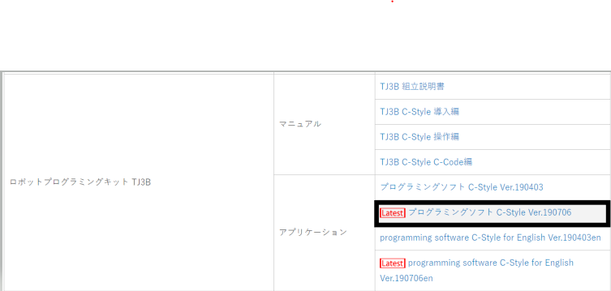

## 下にダウンロードの表示が出るので、残りが0秒になったらそこをダブルクリック

↓ Chromeでのダウンロード画面

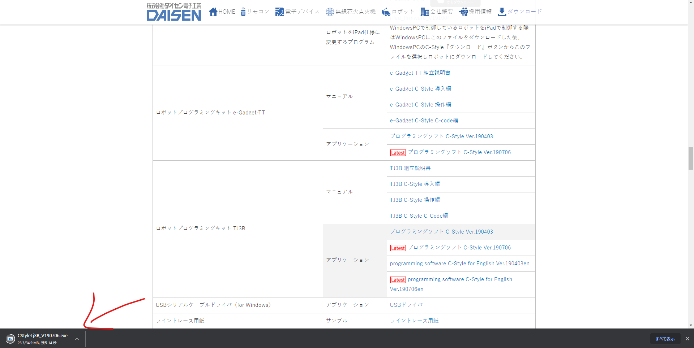

↓ Firefoxでのダウンロード画面

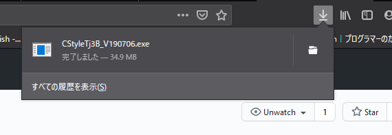

## 下の写真のようにWindowsによってPCが保護されましたと出たら詳細情報をクリックしてから、実行ボタンをクリック

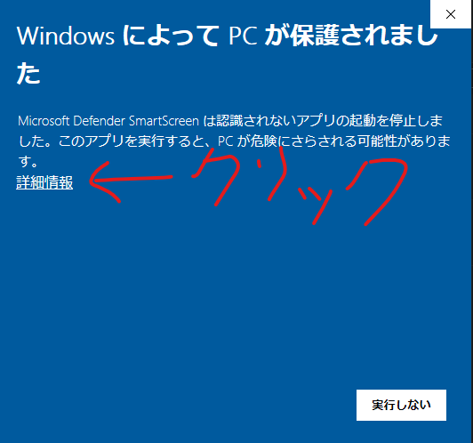

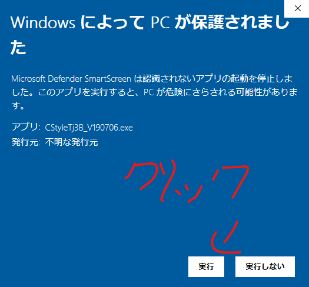

## 「CStyleTj3B_V数字.exe」をダブルクリック

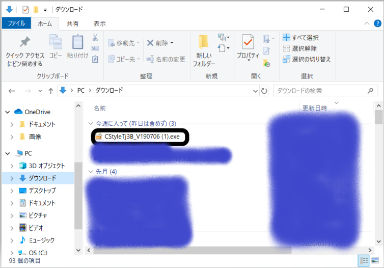

## 「圧縮解除」をクリック

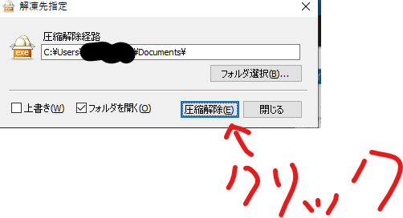

## 「圧縮解除が完了しました。(100%)」と表示されたら、ドキュメントを開いて、「CStyleTj3B_V数字の列」をダブルクリック

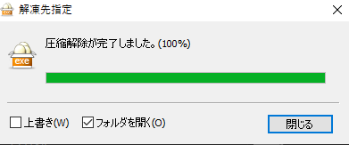

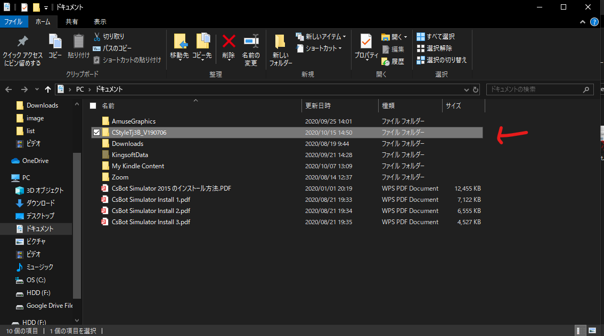

## 「CStyleSetup.exe」をダブルクリックする

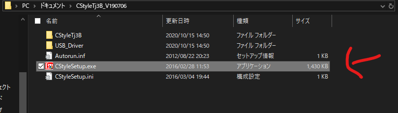

## 「Driver Install」をクリックし、「次へ」をクリックする。

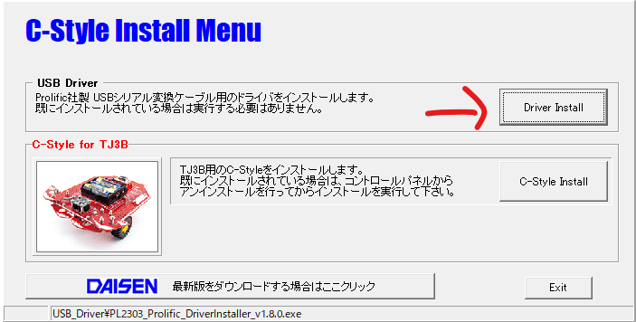

## 「完了」ボタンが出てきたら、「完了」ボタンをクリックする

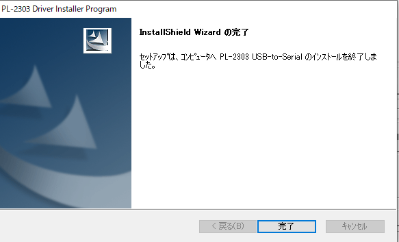

## 「C-Style Install」をクリックし、下のようにクリックする。
* 「次へ」を3度クリック
* 「インストール」をクリック
* 「完了」をクリック

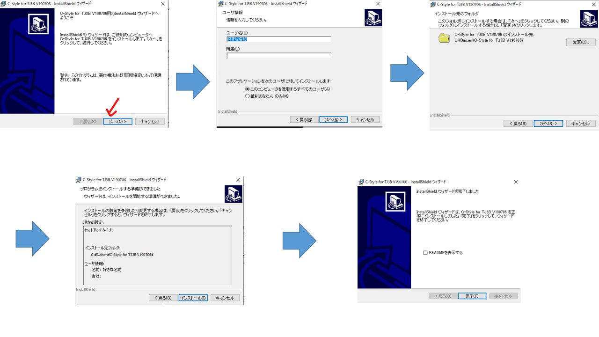

## デスクトップに「CStyle for TJ3B」があるか確認する。

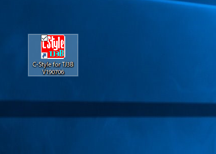

## あるなら、インストール終了!

## インストール準備は終わりです。お疲れさまでした。
